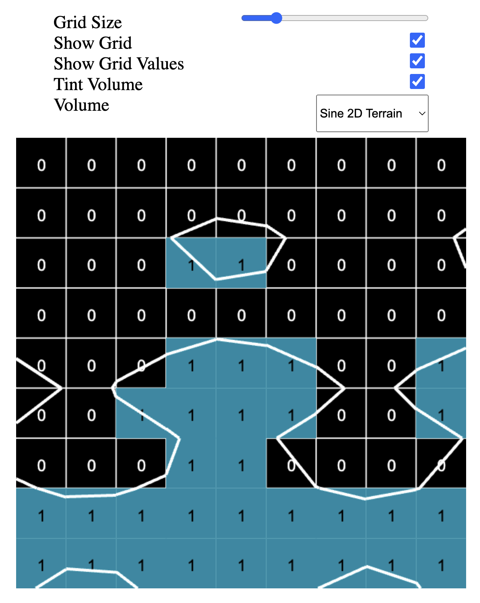

# Marching Squares Algorithm Visualizer

This tool provides a visual representation of the marching squares algorithm applied to various volume functions and grid sizes.

It's designed to enhance your understanding of this algorithm through interactive visualization.

Included volume functions are: Sine 2D Terrain, Sine 1D Terrain, Circle, Square

## Screenshots

